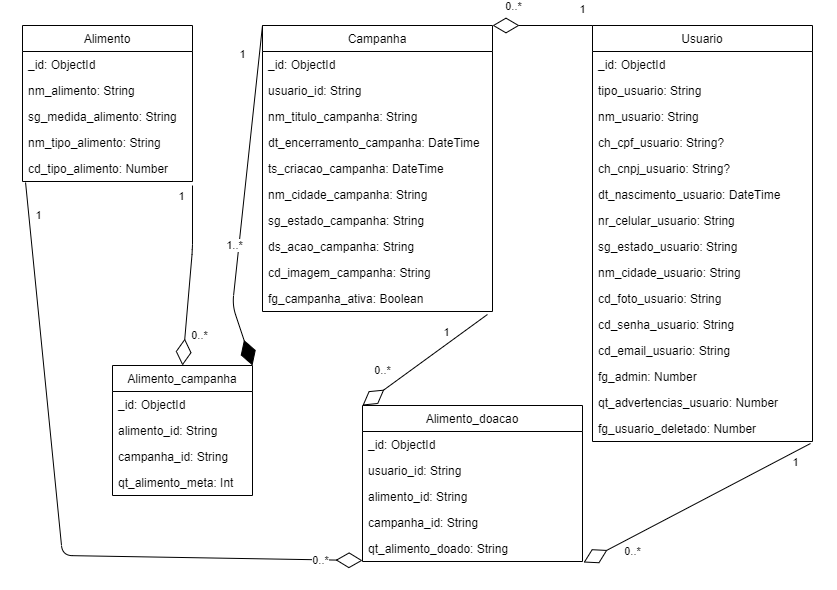

# Nação Nutrida

Nosso projeto tem um propósito especial: arrecadar alimentos para doação. Através de doações virtuais, os usuários podem contribuir com alimentos básicos que serão entregues a quem mais precisa.

## 🚀 Iniciando

Bem-vindo ao Nação Nutrida! Estamos ansiosos para que você contribua para este projeto e ajude a fazer uma diferença na vida das pessoas.

### 📋 Pré-requisitos

```
Node.js >=  a versão 14.17.0
npm >= a versão 6.14.13
prisma >= a versão 5.20.0
```

### 🔧 Instalação

1. Na pasta raiz, instale as dependências do projeto:
```
npm install
```

2. Na pasta server, instale as dependências:
```
npm install
```

3. Conecte-se ao banco de dados:
  * Faça uma cópia do arquivo .env.example na pasta server
  * Renomeie a cópia para .env
  * Insira a sua string de conexão do mongodb em 'DATABASE_URL' e coloque /nacao-nutrida no final

Exemplo:
```
DATABASE_URL="mongodb+srv://<Seu_Usuario>:<Sua_Senha>@cluster0.nql6p.mongodb.net/nacao-nutrida"
```

4. Na pasta server, sincronize seu schema Prisma com o banco de dados:
```
npx prisma db push --schema .\prisma\schema.prisma
```

4. Na pasta server, gere o cliente prisma:
```
npx prisma generate .\prisma\schema.prisma
```

5. Na pasta server, execute o script para popular o banco de dados:
```
npm run seed
```

## Executando o projeto

Front-End:
1. Na pasta raiz do projeto, execute:
```
npm run start
```

Back-End: 
1. Na pasta server, execute:
```
npm run dev
```

## 🛠️ Tecnologias Utilizadas
* [Typescript](https://www.typescriptlang.org/)
* [React](https://react.dev/)
* [MongoDB](https://www.mongodb.com/pt-br)


## 📌 Versão

Versão atual 0.0.3

## Modelagem Conceitual


## Diagrama NoAM




## 🎁 Agradecimentos

Gostaríamos de expressar nossa gratidão a todos os colegas e participantes do projeto pelo empenho, dedicação e colaboração ao longo do desenvolvimento do "Nação Nutrida". Cada um contribuiu de maneira única e indispensável para o sucesso do projeto.

Encorajamos todos a compartilhar este projeto com outras pessoas. Nossa jornada não apenas fortaleceu nossas habilidades profissionais, mas também nos aproximou como equipe. Vamos inspirar outros com o que alcançamos juntos!

---
❤️😊
